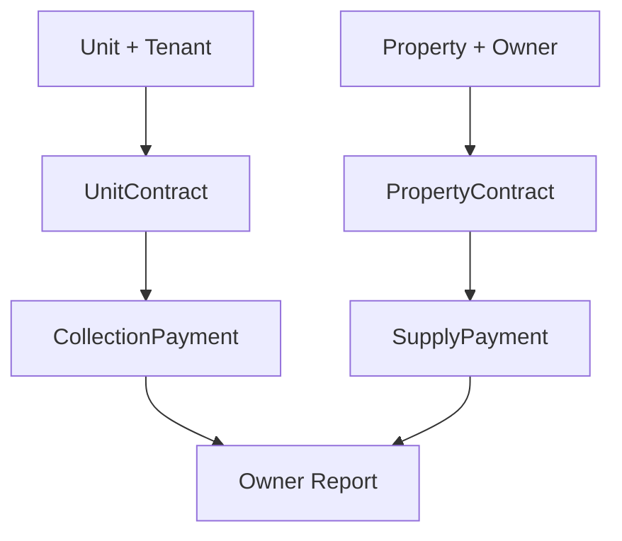

# 📊 تقرير تقني: مشكلة عدم ظهور الدفعات في تقارير الملاك

**التاريخ:** 2025-09-03  
**النظام:** AqarCRM - نظام إدارة العقارات  
**الإصدار:** Laravel 12 + Filament 4  
**كاتب التقرير:** فريق التطوير التقني  

---

## 📌 ملخص تنفيذي

تم اكتشاف مشكلة حرجة في النظام حيث لا تظهر أي دفعات أو مبالغ في تقارير الملاك رغم وجود عقود إيجار نشطة. السبب الجذري كان عدم وجود عقود الملاك (PropertyContract) التي تربط بين المالك والشركة، مما منع توليد دفعات التوريد والتحصيل.

---

## 🔴 وصف المشكلة

### الأعراض المشاهدة:

#### في تقرير المالك:
```
تقرير المالك - محمد أحمد
------------------------
العقار         | دفعات التحصيل | المحصل    | رسوم الإدارة
عمارة النخيل   | 0             | 0.00 ر.س  | 0.00 ر.س
عمارة الورود   | 0             | 0.00 ر.س  | 0.00 ر.س
الإجمالي       |               | 0.00 ر.س  | 0.00 ر.س
```

#### في صفحة المستأجر:
```
المستأجر: عبدالله سالم
----------------------
إجمالي المدفوع: 0.00 ريال
مدفوعات مستحقة: 0.00 ريال
عدد الدفعات: 0
```

### التأثير على النظام:
- ❌ عدم القدرة على تتبع المستحقات المالية
- ❌ تقارير مالية غير دقيقة
- ❌ عدم إمكانية حساب عمولات الإدارة
- ❌ تعطل دورة المدفوعات بالكامل

---

## 🔍 التشخيص

### الخطوات المتبعة:

#### 1. فحص قاعدة البيانات:
```php
// التحقق من وجود دفعات التحصيل
CollectionPayment::where('property_id', $property->id)->count();
// النتيجة: 0

// التحقق من عقود الملاك
PropertyContract::whereHas('property', function($q) use ($owner) {
    $q->where('owner_id', $owner->id);
})->count();
// النتيجة: 0 ⚠️
```

#### 2. فحص العلاقات:
```
UnitContract (عقود الإيجار) ✅ موجودة
     ↓
CollectionPayment (دفعات التحصيل) ❌ مفقودة
     ↓
PropertyContract (عقود الملاك) ❌ مفقودة
     ↓
SupplyPayment (دفعات التوريد) ❌ مفقودة
```

### الأدوات المستخدمة:
- Laravel Tinker للاستعلامات
- Filament UI لمراجعة الواجهات
- PaymentGeneratorService لفهم المنطق

---

## 💡 السبب الجذري

### المشكلة الأساسية:
النظام يتطلب وجود **PropertyContract** (عقد بين المالك والشركة) قبل أن يتمكن من:

1. توليد دفعات التوريد (SupplyPayment)
2. حساب عمولات الإدارة
3. عرض البيانات في التقارير

### سلسلة الاعتمادية:


### الكود المسؤول:
```php
// PaymentGeneratorService.php
public function generateSupplyPaymentsForContract(PropertyContract $contract): int
{
    // يتطلب PropertyContract موجود
    if (!$contract->canGeneratePayments()) {
        throw new \Exception('لا يمكن توليد دفعات لهذا العقد');
    }
    // ...
}
```

---

## ✅ الحل المطبق

### 1. إنشاء عقود الملاك المفقودة:
```php
PropertyContract::create([
    'property_id' => $property->id,
    'start_date' => Carbon::now()->startOfMonth(),
    'duration_months' => 12,
    'payment_frequency' => 'monthly',
    'commission_rate' => 10, // نسبة الإدارة 10%
    'contract_file' => 'dummy.pdf',
]);
```

### 2. توليد دفعات التحصيل:
```php
$paymentService = new PaymentGeneratorService();
foreach ($unitContracts as $contract) {
    $payments = $paymentService->generateTenantPayments($contract);
}
```

### 3. توليد دفعات التوريد:
```php
foreach ($propertyContracts as $contract) {
    $count = $paymentService->generateSupplyPaymentsForContract($contract);
}
```

### السكريبت الكامل:
- **الملف:** `tests/development/create-property-contracts.php`
- **الغرض:** إنشاء العقود المفقودة وتوليد الدفعات

---

## 📈 النتائج والتحقق

### البيانات المنشأة:
| النوع | العدد | الإجمالي |
|-------|-------|----------|
| عقود الملاك | 2 | - |
| دفعات التوريد | 24 | - |
| دفعات التحصيل - عمارة النخيل | 13 | 32,500 ر.س |
| دفعات التحصيل - عمارة الورود | 13 | 36,400 ر.س |
| **الإجمالي الكلي** | **26** | **68,900 ر.س** |

### التحقق من الحل:
```php
// بعد تطبيق الحل
PropertyContract::count(); // 2 ✅
SupplyPayment::count();    // 24 ✅
CollectionPayment::count(); // 26 ✅
```

---

## 📚 الدروس المستفادة

### 1. التصميم:
- ⚠️ النظام يعتمد على سلسلة من العلاقات المترابطة
- ⚠️ عدم وجود حلقة واحدة يعطل السلسلة كاملة
- ⚠️ عدم وجود رسائل خطأ واضحة عند فقدان البيانات المطلوبة

### 2. الاختبار:
- ❗ ضرورة إنشاء بيانات تجريبية كاملة عند الاختبار
- ❗ التأكد من وجود جميع العلاقات المطلوبة
- ❗ اختبار التقارير بعد كل تغيير في البيانات

### 3. التوثيق:
- 📝 توثيق العلاقات المطلوبة بين الجداول
- 📝 توضيح متطلبات إنشاء البيانات
- 📝 إضافة تعليقات في الكود للعلاقات الحرجة

---

## 🎯 التوصيات

### للتطوير المستقبلي:

#### 1. تحسين تجربة المستخدم:
```php
// إضافة تحقق عند عرض التقرير
if (!$owner->propertyContracts()->exists()) {
    return redirect()->back()->with('warning', 
        'لا توجد عقود ملكية. يجب إنشاء عقد مع الشركة أولاً.'
    );
}
```

#### 2. أتمتة إنشاء العقود:
```php
// عند إضافة عقار جديد، إنشاء عقد تلقائياً
Property::created(function ($property) {
    PropertyContract::create([
        'property_id' => $property->id,
        'start_date' => now(),
        'duration_months' => 12,
        // ...
    ]);
});
```

#### 3. إضافة validations:
```php
// التحقق من وجود عقد ملكية قبل إنشاء عقد إيجار
public function store(Request $request)
{
    $property = Property::find($request->property_id);
    
    if (!$property->propertyContract) {
        return back()->withErrors([
            'property_id' => 'يجب إنشاء عقد ملكية للعقار أولاً'
        ]);
    }
    // ...
}
```

#### 4. لوحة تحكم للمراقبة:
- إضافة widget يعرض العقارات بدون عقود ملكية
- تنبيهات للعقود المنتهية
- مؤشرات للدفعات المفقودة

#### 5. سكريبت صيانة دوري:
```bash
# Artisan command للفحص الدوري
php artisan contracts:check-integrity
```

---

## 🔧 الملفات المتأثرة

### الملفات المنشأة:
1. `tests/development/create-property-contracts.php` - سكريبت الإصلاح
2. `tests/development/create-conflict-test-data.php` - بيانات الاختبار الأولى
3. `tests/development/create-same-owner-conflict-test.php` - بيانات الاختبار الثانية
4. `docs/reports/property-contracts-issue-report.md` - هذا التقرير

### الملفات المعدلة:
1. `app/Filament/Resources/PropertyContractResource.php` - تعديل رسالة النوتيفيكيشن

---

## 📞 معلومات الاتصال

**في حالة وجود استفسارات:**
- فريق التطوير التقني
- نظام AqarCRM
- تاريخ التقرير: 2025-09-03

---

## 🔄 سجل التحديثات

| التاريخ | الإجراء | المسؤول |
|---------|---------|---------|
| 2025-09-03 | اكتشاف المشكلة | فريق التطوير |
| 2025-09-03 | تطبيق الحل | فريق التطوير |
| 2025-09-03 | كتابة التقرير | فريق التطوير |

---

**نهاية التقرير**